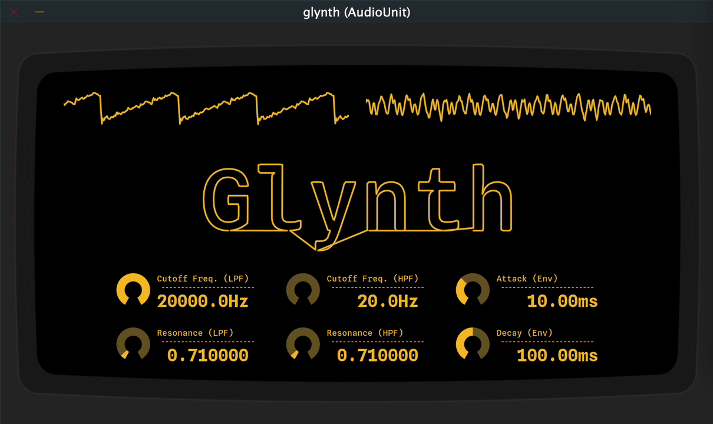

# Glynth

Synthesize audio by tracing text glyphs! Work-in-progress.



## Installation

Glynth is built with CMake, and the only current install method is to build from source. The commands below will build Glynth as an AU plugin using the Ninja generator:

```bash
# run from the project root
cmake -B build -G Ninja
cmake --build build --target glynth_AU
```

Other targets are available as well, such as `glynth_Standalone`. See a list of all of them by building the `help` target.

When complete, this section will link to downloads of built and signed plugins that can be installed in a more standard way.

## Disclaimer

This software is still a work-in-progress. It works on a good day, but it's missing features like a finalized visualization and dynamic voice count, and there are many breaking bugs (e.g. the plugin crashes Logic Pro when the input configuration changes...).

While incomplete, I performed a small piece based on the version of Glynth at commit `8acbfd2` as part of my final project performance for Cornell's [MUSIC 1421: Introduction to Digital Music](http://digital.music.cornell.edu/courses/music1421/) on 2025-12-10.
